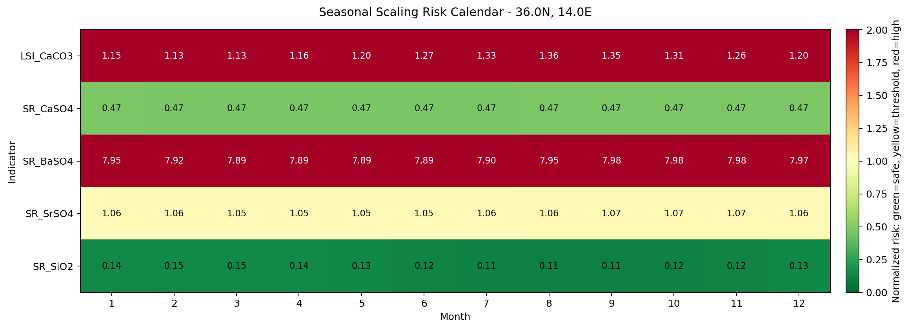
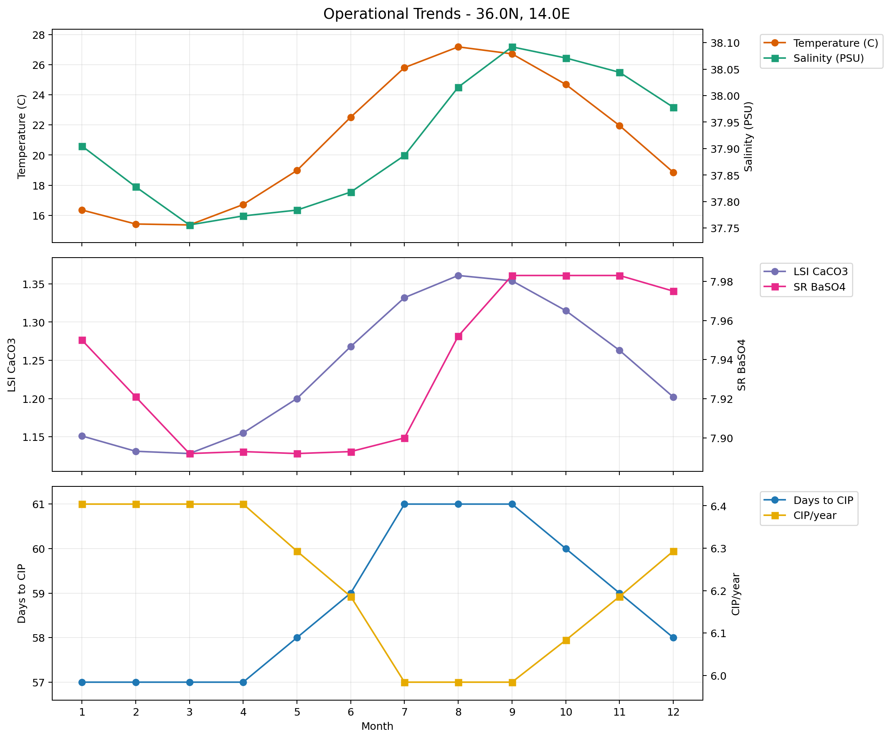
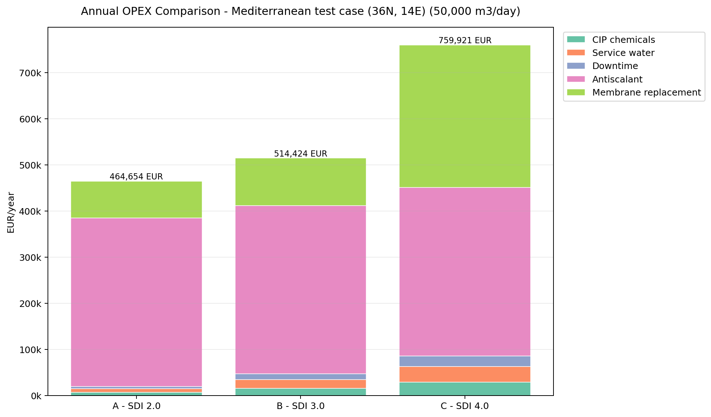

# RO Operational Planner

An integrated planning tool that combines seasonal water variability, 
scaling risk and CIP frequency optimization to support operational and 
EPC design decisions for RO desalination plants.

## Live Demo
👉 Coming soon

---

## The Problem

Conventional design tools analyze scaling risk and fouling separately, 
using static or average water quality values. In reality, the feed water 
of a coastal RO plant varies significantly throughout the year, and 
those two phenomena interact: the same plant operates in different 
risk regimes depending on the month.

EPC engineers designing the pretreatment system, antiscalant strategy 
and CIP frequency typically lack an integrated view of how these 
interact across the year for a specific location.

---

## What This Tool Does

Given the geographic coordinates of a coastal desalination plant 
and its design parameters, this tool:

1. Retrieves 11 years of historical temperature and salinity from 
   Copernicus Marine Service (CMEMS)
2. Reconstructs the monthly ionic profile of the feed water
3. Calculates scaling indices and CIP frequency month by month
4. Generates an operational calendar showing critical periods
5. Estimates annual membrane OPEX under different pretreatment scenarios
6. Quantifies the economic impact of design decisions

---

## Key Findings (Mediterranean test case)

### Seasonal Scaling Risk Calendar


### Operational Trends Across the Year


### Economic Impact of Pretreatment Choice


For a 50,000 m³/day plant in the Central Mediterranean:

| Scenario | SDI target | CIP/year | Annual OPEX | Δ vs baseline |
|---|---|---|---|---|
| A - Excellent pretreatment | 2.0 | 2.6 | 464,654 € | -49,770 € |
| B - Standard pretreatment | 3.0 | 6.2 | 514,424 € | baseline |
| C - Limited pretreatment | 4.0 | 11.4 | 759,921 € | +245,496 € |

**The cumulative OPEX difference between excellent and limited 
pretreatment is approximately 295,000 €/year, or ~5.9 M€ over a 
20-year plant lifecycle.**

---

## How It Builds on Previous Work

This project integrates two previous open-source tools:

- [RO Scaling Risk Estimator](https://github.com/alvmenbon/ro-scaling-risk) — 
  Provides the physics for scaling indices and ionic profile reconstruction
- [RO Fouling Optimizer](https://github.com/alvmenbon/ro-fouling-optimizer) — 
  Provides the fouling model and CIP frequency estimation

The integration adds:
- Monthly seasonal coupling of both physics modules
- Economic translation through the OPEX estimator
- Comparative scenario analysis

---

## Scope and Limitations

**Works well for:**
- Open ocean and semi-enclosed seas
- Conceptual and basic design phases
- Comparative scenario analysis

**Known limitations:**
- Physics models based on simplified power-law cake filtration
- SDI assumed constant throughout the year (no biological seasonality)
- Synthetic operational data only — should be recalibrated with 
  real plant data when available
- Cost coefficients are typical SWRO values, adjust to your local context

---

## Project Structure

```
ro-operational-planner/
│
├── core/
│   ├── seasonal_integrator.py   # Couples Copernicus + scaling + fouling
│   ├── opex_estimator.py        # Annual OPEX calculation
│   ├── scaling_indices.py       # (from ro-scaling-risk)
│   ├── ro_concentration.py      # (from ro-scaling-risk)
│   ├── water_chemistry.py       # (from ro-scaling-risk)
│   └── fouling_model.py         # (from ro-fouling-optimizer)
│
├── copernicus/
│   └── fetcher.py               # (from ro-scaling-risk)
│
├── outputs/
│   └── operational_report.py    # Visualizations
│
└── test_*.py                    # Validation scripts
```

---

## Requirements

```bash
pip install numpy scipy matplotlib pandas scikit-learn copernicusmarine xarray jupyter streamlit
```

Free Copernicus Marine Service account required: marine.copernicus.eu

---

## Author

Álvaro Mendoza — Process Engineer, Water Sector  
[LinkedIn](https://www.linkedin.com/in/alvaro-mendoza-bonilla)  
[GitHub](https://github.com/alvmenbon)
